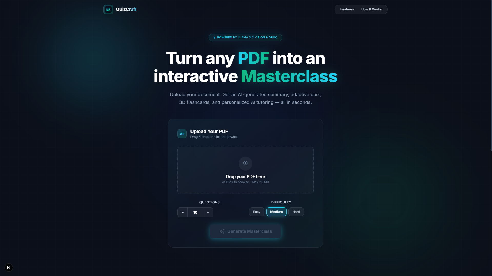
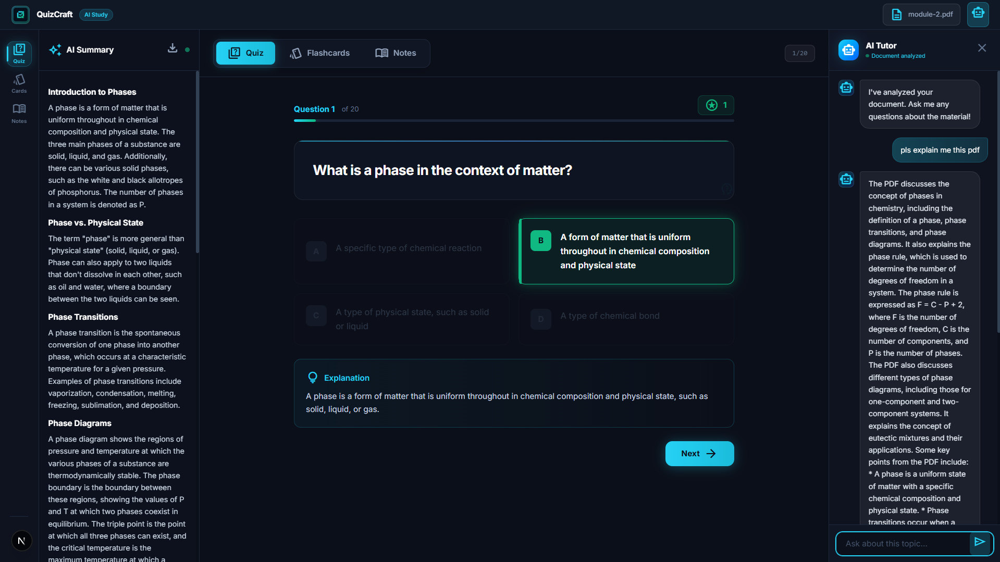
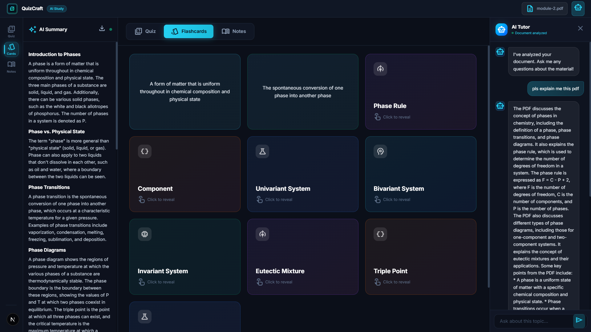
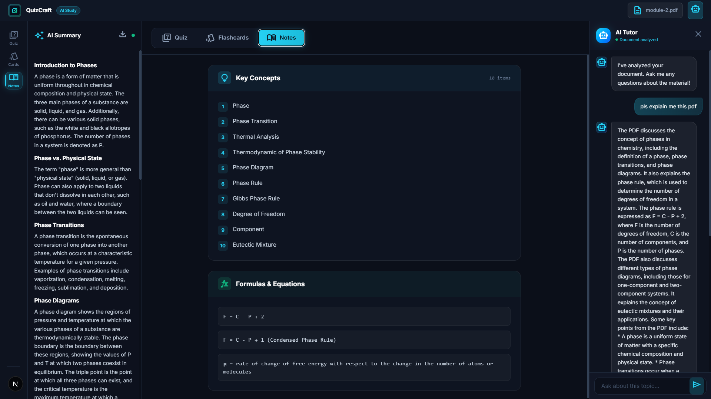
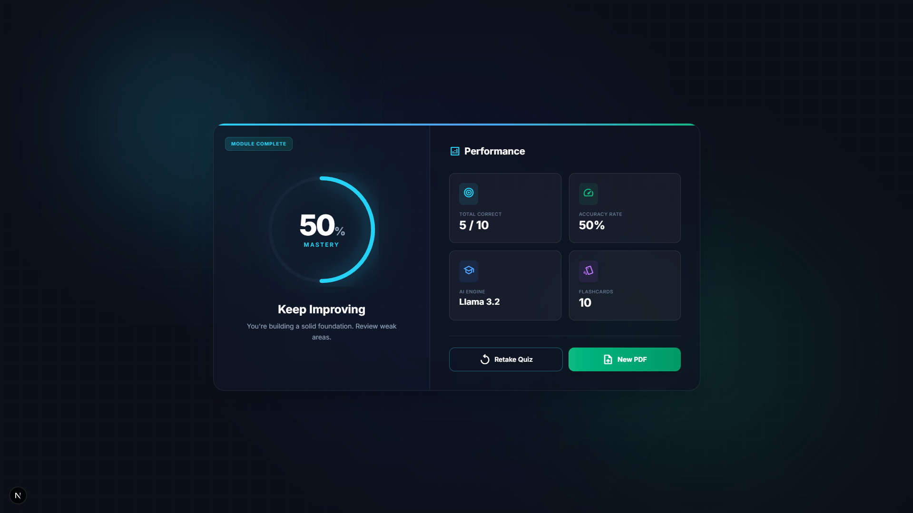

<div align="center">

# QuizCraft

**Turn any PDF into an interactive AI-powered masterclass.**

*Upload your study material. Get an AI-generated summary, adaptive quiz, 3D flashcards, smart notes, and a personal AI tutor — all in seconds.*

[Live Demo](https://quizcraft-six.vercel.app/) · [API](https://quizcraft-api-76e8.onrender.com/) · [Report Bug](https://github.com/ProjectExhibitionGroup/quizcraft/issues) · [Request Feature](https://github.com/ProjectExhibitionGroup/quizcraft/issues)

</div>

---

<!-- SCREENSHOTS: Replace these placeholders with your actual screenshots -->
<!-- Save screenshots as .png files in the screenshots/ folder -->

<div align="center">
  
</div>

## About

QuizCraft is an intelligent study assistant that uses **Llama 3.2 Vision** and **Groq's** ultra-fast inference to transform PDFs into comprehensive study modules. Whether you're preparing for exams or reviewing research papers, QuizCraft extracts key concepts and creates an interactive learning experience.

### Key Features

| Feature | Description |
|---|---|
| **AI-Powered Quiz** | Generates adaptive multiple-choice questions with difficulty control and AI explanations |
| **3D Flashcards** | Interactive flip cards with gradient themes for visual memorization |
| **Smart Notes** | Auto-generated cheat sheet with key concepts, formulas, and important dates |
| **AI Tutor Chat** | Context-aware chatbot that answers questions about your uploaded document |
| **Document Summary** | Formatted markdown summary with PDF download capability |
| **Vision OCR** | Extracts text from scanned PDFs using Llama 3.2 Vision |

### Screenshots

<div align="center">

| Dashboard — Quiz Mode | Dashboard — Flashcards |
|:---:|:---:|
|  |  |

| Notes & Chat | Results Analytics |
|:---:|:---:|
|  |  |

</div>

---

## Tech Stack

### Frontend
- **Framework**: Next.js 15 (React, TypeScript)
- **Styling**: Tailwind CSS 4
- **Markdown**: react-markdown
- **Design**: Custom dark theme with glassmorphism and neon accents

### Backend
- **API Server**: Flask (Python)
- **PDF Processing**: pdfplumber, pdf2image, Pillow

### AI / ML
- **Vision Model**: `llama-3.2-11b-vision-preview` — OCR and layout analysis
- **Text Model**: `llama-3.3-70b-versatile` — Quiz generation, summarization, tutoring
- **Primary Inference**: Groq LPU (ultra-low latency)
- **Fallback Inference**: NVIDIA NIM API (automatic failover on rate limits)

---

## Architecture

```
┌─────────────────┐         ┌──────────────────────────────────┐
│   Next.js App   │  HTTP   │          Flask API Server        │
│   (Port 3000)   │◄───────►│          (Port 5000)             │
│                 │         │                                  │
│  Landing Page   │         │  /api/upload   → PDF Processing  │
│  Quiz Dashboard │         │  /api/chat     → AI Tutor        │
│  Flashcards     │         │  /api/explain  → Explanations    │
│  Notes View     │         │                                  │
│  Results Page   │         │  ┌────────────┐ ┌─────────────┐  │
│  AI Chat Panel  │         │  │  Groq API  │ │ NVIDIA NIM  │  │
└─────────────────┘         │  │ (Primary)  │ │ (Fallback)  │  │
                            │  └────────────┘ └─────────────┘  │
                            └──────────────────────────────────┘
```

---

## Getting Started

### Prerequisites
- **Node.js** 18+ and npm
- **Python** 3.8+
- A [Groq API Key](https://console.groq.com/) (free)
- *(Optional)* [NVIDIA NIM Key](https://build.nvidia.com/) for fallback

### Installation

1. **Clone the repository**
   ```bash
   git clone https://github.com/ProjectExhibitionGroup/quizcraft.git
   cd quizcraft
   ```

2. **Set up the backend**
   ```bash
   python -m venv venv
   venv\Scripts\activate        # Windows
   # source venv/bin/activate   # macOS/Linux
   pip install -r requirements.txt
   ```

3. **Configure environment variables**
   
   Create a `.env` file in the project root:
   ```ini
   GROQ_API_KEY=your_groq_api_key_here
   NVIDIA_API_KEY=your_nvidia_api_key_here   # optional fallback
   ```

4. **Set up the frontend**
   ```bash
   cd frontend
   npm install
   ```

5. **Run both servers**

   Terminal 1 — Backend:
   ```bash
   python app.py
   ```

   Terminal 2 — Frontend:
   ```bash
   cd frontend
   npm run dev
   ```

6. **Open** `http://localhost:3000` in your browser.

---

## Project Structure

```
quizcraft/
├── app.py                  # Flask API server
├── requirements.txt        # Python dependencies
├── .env                    # API keys (not committed)
├── .gitignore
├── frontend/
│   ├── src/
│   │   └── app/
│   │       ├── page.tsx    # Main application (all views)
│   │       ├── layout.tsx  # Root layout, metadata, fonts
│   │       └── globals.css # Design system & theme
│   ├── public/
│   │   └── favicon.png     # QuizCraft logo
│   └── package.json
└── screenshots/            # README images
```

---

## Team

Built for **Project Exhibition — 1** | B.Tech 2nd Year, 2nd Semester

---

## License

Distributed under the MIT License. See `LICENSE` for more information.
